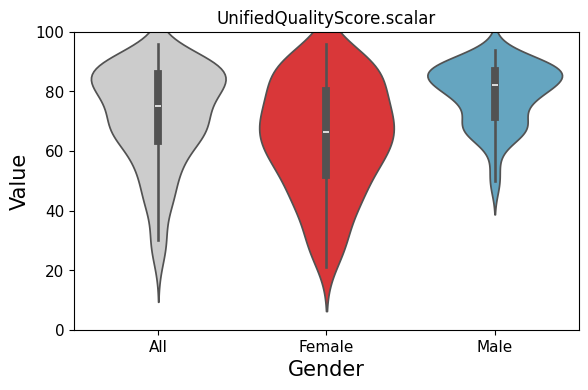
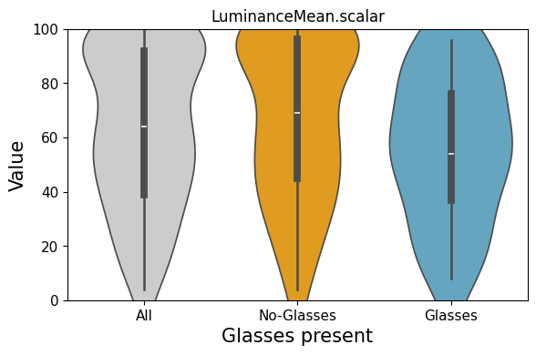
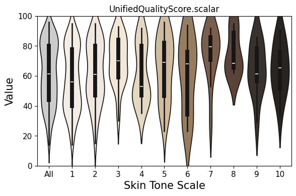

# OFIQ-Analysis on Demographic Variability 

This script creates violinplots for quality measures defined in ISO/IEC 29794-5 [1] and investigates the demographic variability (DV) across different demographic groups. The DV is measured with the low weighted mean (LWM-DD) as demographic differential metric. Moreover the script computes quality measure thresholds for all quality components according to the percentiles of the data.

The immediate purpose of the script is to produce violinplots, LWM-DD values and threshold tables for the development of the technical report ISO/IEC TR 25722 [2]. The intention is that contributions report the DV on operational data and appear in a harmonised and standardised fashion. An example is the recent contribution to ISO/IEC TR 25722  by Utcke et al. [3].

This script will be contributed to ISO/IEC 29794-1 and will eventually become part of that standard.

## Example data

Example data files can be found in the subfolder data.

## Getting started

Note: In order to process the CSV file with quality measures, the header of the CSV must follow the convention of OFIQ 1.1.3 containing the suffix .native and .scalar. In order to get started with older CSV-files you can copy the new header from the file corr-lables.scv in the subfolder data.

## Usage: 

python DV-OFIQ-stats-with-violinplots.py --input_csv INPUT_CSV --variable VARIABLE --measure MEASURE --color COLOR --output_folder OUTPUT_FOLDER

## Example calls

- python DV-OFIQ-stats-with-violinplots.py --input_csv ONOT-OFIQ-Values-UC1-corr-labels-260217.csv --variable gender --measure UnifiedQualityScore.scalar --color true --output_folder results

 

- python DV-OFIQ-stats-with-violinplots.py --input_csv Multi-PIE-glasses-corr-lables-260217.csv --variable glasses --measure LuminanceMean.scalar --color true --output_folder results

 

- python DV-OFIQ-stats-with-violinplots.py --input_csv FRLL-full-corr-labels-260217.csv --variable skintone --measure UnifiedQualityScore.scalar --color true --output_folder results

 

## Violin plots

Violin plots are created following the methodology defined in ISO/IEC 29794-1:202x [3]. 

## Threshold tables

For *all* quality‑measure columns the five operational thresholds (0.1 %, 1 %, 5 %, 10 %, 15 %) are computed and stored in a CSV file.

## Demographic differential

As metric to assess the demographic differential (i.e. the "extent of difference in outcome of a biometric system across socially recognized sectors of the population"), which has been defined in ISO/IEC 2382-37 [5] the script computes the Low-Weighted-Mean-Demographic-Differential (LWM-DD) score with a lower is better semantic. The LWM-DD follows the approach from Doersch et al. [6].

## References

[1]   ISO/IEC JTC1 SC37 Biometrics. ISO/IEC 29794-5 Biometric Sample Quality - Part 5: Face image data. (2025), https://www.iso.org/standard/81005.html

[2]   ISO/IEC JTC1 SC37 Biometrics. ISO/IEC TR 25722, Demographic variability of face image quality measures. Technical report, (2026), https://www.iso.org/standard/91308.html

[3]   ISO/IEC JTC1 SC37 Biometrics. ISO/IEC 29794-1 Biometric Sample Quality - Part 1: Framework. (2026), https://www.iso.org/standard/91309.html

[4]   S. Utcke, S. Kramp, S. Engelhardt, W. Kabbani, C. Rathgeb, T. Schlett, J. Merkle, B. Tams, J. Wehen, C.Busch: "Demographic Variability of Face Image Quality Measures in Operational Data", in IEEE Access, (2026), https://ieeexplore.ieee.org/document/11411711

[5]   ISO/IEC JTC1 SC37 Biometrics. ISO/IEC 2382-37 Vocabulary — Part 37: Biometrics, (2022), https://www.iso.org/obp/ui/en/#iso:std:iso-iec:2382:-37:ed-3:v1:en:sec:37.09.28

[6]   A. Dörsch, T. Schlett, P. Munch, C. Rathgeb, C. Busch: "Fairness measures for biometric quality assessment", in Proceedings of 2nd Workshop on Fairness in Biometric Systems (ICPR), (2024), https://link.springer.com/chapter/10.1007/978-3-031-87657-8_20
